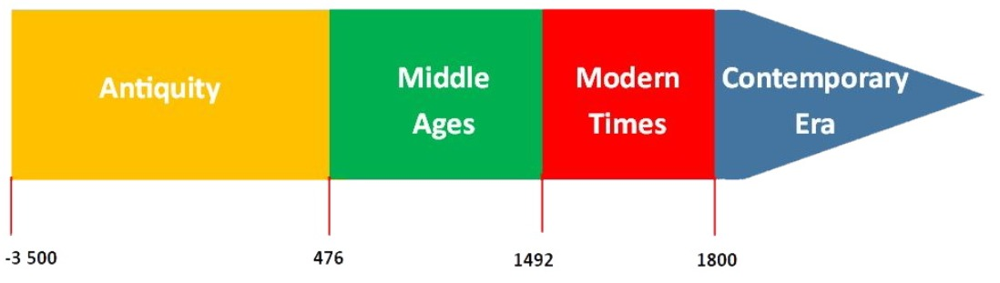

# Museum_data_camp

Authors :

- Abdallah GAZAL
- Terence NGO
- Cynthia WANG
- Loïc MARY
- Anton EMELCHENKOV
- Slimane BAAMARA

## Context

  The art market reached a world record in 2021: auctions reached a total of $17 billion. This market is not the best known, but it is growing and more and more people want to buy a work of art. In this context, machine learning could play a major role in the development of the art market. To project oneself and precisely understand the possible contributions of machine learning to the art market, it is necessary to start from the current problems of the market. If we look in more detail at main actors of the market (buyers, sellers, etc.), one of their major issue is the valuation of art objects. Usually, professionals give an estimate of the value by carrying out a scrupulous examination of the object. However, their work is tedious, time-consuming and the estimate could be wrong. 

## Definition of the problem

Our idea is to use machine learning to help decision-making in the process of evaluating an art object. In this work, we will focus on a specific aspect of the evaluation process: estimating the creation date of the artwork. This is a very important information needed by the the appraisal professional in order to give a value to the object. 

In this challenge, we will only try to predict the historical period (Antiquity, Middle Age, Modern Time, Contempory Era) of a specific artwork given multiple features about the object. Therefore, we will have to deal with a classification problem. In addition, multiple features of the dataset are "dirty" and categorical. Therefore, this challenge will also require a feature extraction task. 

For the metrics, we will look at :

* The Negative log likelihood, this loss function is often used for multiclass classification problems
* We will also look at the accuracy of our results

## Preprocessing of the data
There is a file process_data.py which is used for preprocessing of features in the dataset. The functions of this file are used in the notebook museum_objects.ipynb

## Starting kit

The notebook presenting the context of the problem is `museum_objects.ipynb`. You can find all our choices to tackle the problem, and some data visualization.
You can also find the first model used as a first baseline in the folder `submissions/starting_kit`

## Submission
Before submitting make sure to test your model and check that everything works fine. 
In order to do that you can run : 

`ramp_test_submission --submission starting_kit` 

or for a quick test : 

`ramp_test_submission --submission starting_kit --quick-test`

Notice that this unit test run in the folder submissions/starting_kit.

Before running the test, make sure you have :
* Installed ramp-workflow.
* Installed the requirements ( `pip install -r requirements.txt` ).
* Put your solution files (feature extractor and a classifier) under the `submissions/starting_kit` folder.
